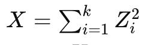

# chisquared
Learning and simulation of chisquared

This repository tries to attempt on learning and simulating chisquared approach by using numpy, pandas, matplotlib.pyplot and seaborn

Repository link: https://github.com/saromaddy/chisquared

Chi-Squared Distribution
    The Chi-Squared test is a statistical method used to determine if there is a significant association between two categorical variables.

    ​

Reference links: 
1. https://www.youtube.com/watch?v=hcDb12fsbBU
2. 

 